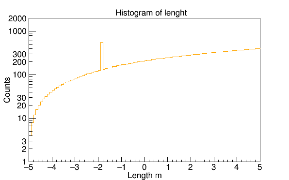

# root.rb - syntax sugar for RubyROOT

root.rb provides syntax-sugar methods for 
[RubyROOT](https://github.com/odakahirokazu/RubyROOT) which is a Ruby binding of
the [CERN's ROOT data analysis framework](https://root.cern.ch).

## Example: Histogram styling

Histogram and graph objects provide the `set` method which takes a block of
commands that manipulates plot settings.

```
require 'ruby-root'

# Prepare sample histogram
hist = Root::TH1D.create('hist', 'Histogram', 100, -5.0, 5.0)
1.upto(hist.GetNbinsX){|i| hist.SetBinContent(i, i*4.0) }
hist.SetBinContent(32, 547.2)
hist.FillRandom("gaus", 150)

# Instantiate file and canvas
file = create_file("output.root")
canvas = create_canvas()

# Set histogram plot style
hist.set {
    # Set label font
    font "Helvetica"
    # Axis labels
    xlabel "Length m"
    ylabel "Counts"
    center_label
    more_log_labels_y
    no_exponent_y
    # Axis range
    yrange 1, 2000
    # Title
    title "Histogram of lenght"
    # Color
    color "orange"
}

# Set canvas (pad) style
canvas.set {
    # Axis scaling
    logy
}

# Plot and then save to a file
hist.plot
canvas.save_as("histogram.png")

# Save to a ROOT file
canvas.Write
hist.Write
file.Close
```

The following is an output of the above script.


